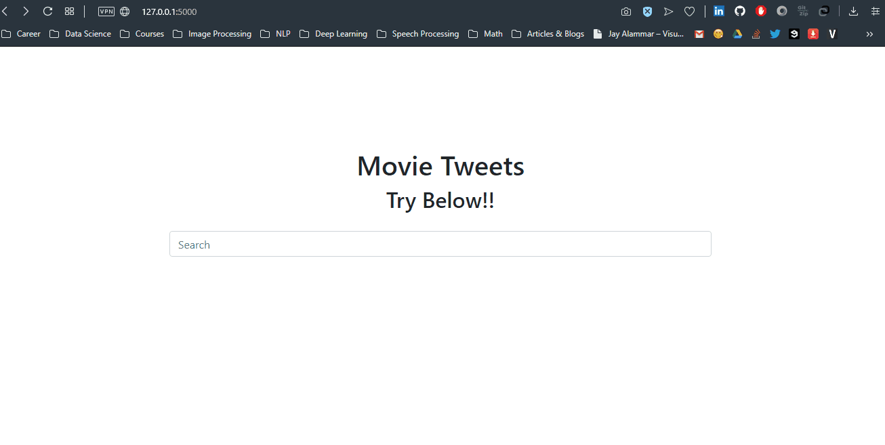

# Movie Tweets Search Engine
This is my attempt to create a Search Engine using Elastic Search over a simple data about IMDb Movie reviews written in tweets. The data was originally made for the RecSys Challenge 2014. I have used just about 8,000 tweets collected from the `test.dat` file. For more information about how I collected the data and structured them, you can check this README. The data I used to be index inside ElasticSearch Engine can be found int the `utils\data` directory.

This data used here looks like this:

| movie_id | movie_name                     | reviews_count | average_tones                            | tweets                                   |
| -------- | ------------------------------ | ------------- | ---------------------------------------- | ---------------------------------------- |
| 993846   | The Wolf of Wall Street (2013) | 535           | {'Anger': 0.2844859585329844, 'Fear': 0.2838749471226159, 'Joy': 0.27755553696029167, 'Sadness': 0.26465190869767846, 'Analytical': 0.2751570982991599, 'Confident': 0.2899761642095416, 'Tentative': 0.27979233958022803} | [{'tweet_id': 4.21051e+17, 'tweet_text': 'I rated The Wolf of Wall Street 1\/10  #IMDb http:\/\/t.co\/eJtRKX4VB5'}, ...] |

This repo contains a Flask application that uses ElasticSeach internally to provide information about movies. These information includes a tone analysis system based on the tweets that reviews that movie and how they rank it. After running the application, it will look like this:

 

## Prerequisites

The prerequisites of this repo is so simple:

- You need to download and install ElasticSearch which can be done easily from [here]([https://www.elastic.co/downloads/elasticsearch)
- You need to install the requirements